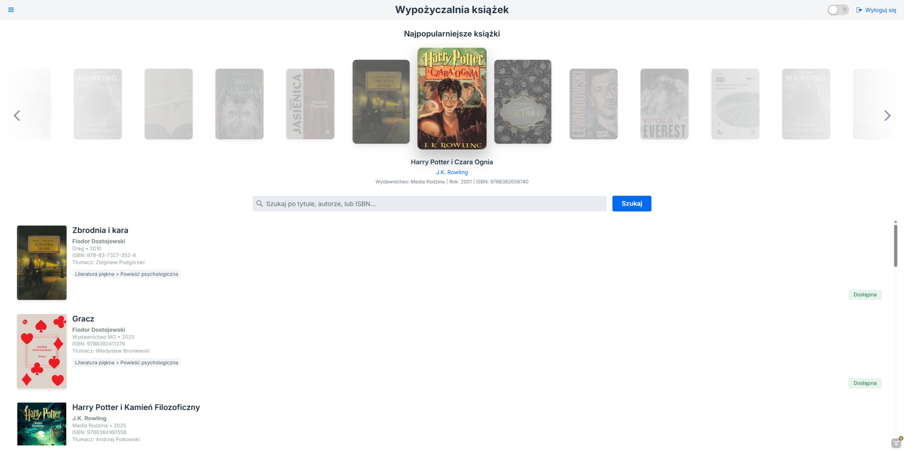
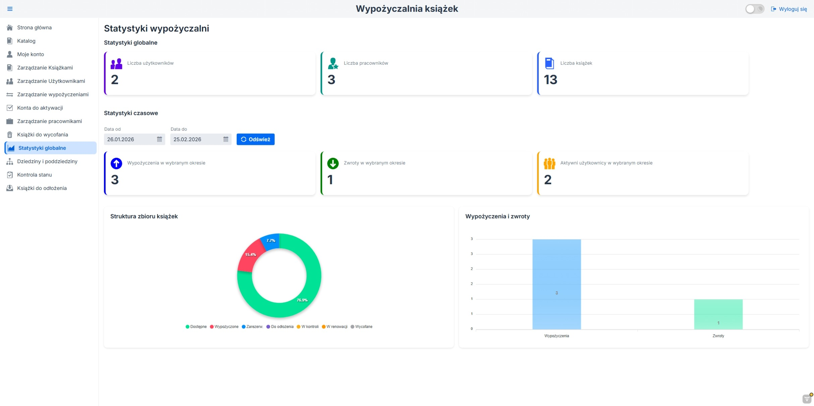

<div align="right">
  <a href="README_pl.md">
    
  </a>
  <a href="README.md">
    
  </a>
</div>

# Library Management System

A management system for a library, built with Java (Spring Boot) and Vaadin. The system streamlines and automates daily library operations. The application allows users to reserve, borrow, and return books. Thanks to the implemented business logic, the system automatically controls borrowing and reservation limits, manages due dates, and calculates penalties for delayed or lost books. The application features a comprehensive role-based access control and a modern user interface designed with convenience and readability in mind.

*Note: The application's UI and sample data presented in the screenshots are in Polish.*

## Screenshots

<div align="center">
  
  <p><i>Home page view featuring a search bar and a scrollable carousel of the most popular books.</i></p>
</div>

<br/>

<div align="center">
  
  <p><i>Interactive statistics and charts dashboard available for the Manager role.</i></p>
</div>

## Technologies

The project utilizes the following technologies:
* **Backend:** Java 25, Spring Boot 3.5, Spring Security, Spring Data JPA
* **Frontend:** Vaadin 24 Flow, CSS, JavaScript
* **Database:** PostgreSQL
* **Database Migrations:** Flyway
* **Containerization:** Docker & Docker Compose
* **Testing:** JUnit 5, Mockito

## Main Features & Roles

The system is divided into specific roles with distinct permissions:

* **Guest (Unauthenticated):** Browsing the catalog and searching for books.
* **Reader:** Borrowing, reserving, and returning books, viewing personal borrowing history and active penalties.
* **Librarian:** User management, account activation, handling physical returns, and managing the book catalog.
* **Warehouse Worker:** Controlling the physical state of the inventory and shelving returned books.
* **Manager:** Creating employee accounts, managing staff, accessing global statistics, and making decisions regarding the withdrawal of damaged books.

## Running the application (Docker)

To run the application in a container (along with the database):

1. Ensure you have Docker installed on your machine.
2. Navigate to the project's root directory and run the following command:

```bash
docker-compose up --build
```
3. The application will be available at: http://localhost:8080/

### Default Admin Credentials (Manager):
* **Email:** `admin@admin.pl`
* **Password:** `admin`

## Testing

The application has unit test coverage for core business logic. To execute the tests, run:

```bash
./mvnw test